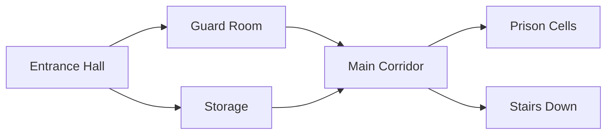

# Formatting Conventions

These conventions ensure consistency across all campaign documents and make them easy to use at the table.

## Read-Aloud Text

**Purpose:** Text the DM reads directly to players to set the scene

**Format:**
```markdown
> Your read-aloud text goes here in a blockquote.
> It should be detailed and verbose to inspire imagination.
> Engage multiple senses: sight, sound, smell, touch.
```

**Guidelines:**
- Use present tense for immediacy
- Engage multiple senses (not just sight)
- Be descriptive but concise enough to read aloud
- No hidden information players shouldn't know
- No dice rolls or mechanical information
- Paint a picture that inspires player imagination
- This text also serves as a prompt for AI image generation

**Example:**
> You push open the heavy wooden door, and it groans on rusty hinges. Before you stretches a vast hall, its vaulted ceiling lost in shadows. Rows of stone columns march toward a distant dais, each carved with scenes of ancient battles. The air is thick with dust and the faint smell of decay. Your footsteps echo in the oppressive silence.

---

## DM Notes

**Purpose:** Information for the DM's eyes only

**Format:** Regular text outside blockquotes

**Contains:**
- Mechanical information (DCs, stats, damage)
- Secret information players shouldn't know yet
- Conditional outcomes based on player actions
- Cross-references to other sections or stat blocks
- Tactical considerations for combat encounters
- Guidance on NPC motivations and reactions

**Example:**
```markdown
The ancient statue is actually a Stone Golem (MM p.170). It animates if anyone
touches the gem on the dais (DC 15 Perception to notice it's trapped). If the
party avoided the trap in Area 3, the golem is already active and hostile.
```

---

## Location/Scene Descriptions

**Structure each location with:**

### 1. Header with Location Name
```markdown
## Area 3: The Grand Hall
```

### 2. Read-Aloud Description
> Detailed, verbose description for the DM to read aloud...

### 3. Image Placeholder
```markdown

```

### 4. DM Information
- What's really happening here
- Hidden details (with Perception DCs)
- Possible player actions and outcomes
- Connections to other areas

### 5. Encounters (if applicable)
- Combat encounters
- NPCs present
- Traps or hazards

### 6. Treasure (if applicable)
- Loot available
- Where it's hidden
- What it reveals about the story

**Complete Example:**
```markdown
## Area 3: The Grand Hall

> You push open the heavy wooden door, and it groans on rusty hinges. Before you
> stretches a vast hall, its vaulted ceiling lost in shadows. Rows of stone columns
> march toward a distant dais, each carved with scenes of ancient battles. The air
> is thick with dust and the faint smell of decay. Your footsteps echo in the
> oppressive silence.


This hall once served as the throne room of the ancient king. The carvings on the
columns tell the story of his conquests (DC 12 History reveals this).

**Hidden Details:**
- DC 15 Perception: Scorch marks on the ceiling suggest a recent fire-based battle
- DC 18 Investigation: Fresh footprints lead to the eastern door

**Encounters:**
If the party makes noise or approaches the dais, 2 Shadow creatures emerge from
the columns (MM p.269).

**Connections:**
- North door leads to Area 4 (locked, DC 15 to pick)
- East door leads to Area 5 (unlocked)
- West door leads to Area 2 (where they came from)
```

---

## Image Prompts

**Purpose:** Detailed prompts for AI image generation tools

**Location:** `campaigns/[campaign-name]/art/[scene-name].md`

**Format:**
```markdown
---
title: grand-hall              # Output filename prefix (required)
aspect_ratio: "4:3"            # Options: 16:9, 9:16, 1:1, 4:3, 3:4
resolution: 2K                 # Options: 1K, 2K, 4K
instructions: dark-fantasy.md  # Optional style instructions file
---

A vast medieval throne room with vaulted ceilings lost in shadow. Rows of
massive stone columns carved with battle scenes march toward a raised dais.
Dust motes drift through shafts of dim light from high windows. The floor
is cracked marble, and shadows pool in the corners. Atmosphere: abandoned,
ancient, ominous. Style: dark fantasy, detailed, realistic.
```

**Guidelines:**
- Base the prompt on the read-aloud text
- Add specific visual style guidance
- Include atmosphere and mood
- Specify important visual elements
- Keep it detailed but focused

---

## Maps

**Purpose:** Visual representation of locations and layouts

### Text-Based Maps
Use for simple layouts or when visual maps aren't needed:

```markdown
### The Dungeon - Level 1

    [1] -------- [2]
     |            |
    [3] -------- [4] -------- [5]
                  |
                 [6]

1. Entrance Hall
2. Guard Room (2 Skeletons)
3. Storage (treasure)
4. Main Corridor
5. Prison Cells
6. Stairs Down to Level 2
```

### Mermaid Diagrams
Use for flow-based layouts or relationship diagrams:

```markdown

```

### Image Placeholders
For detailed battle maps or location maps:

```markdown


**Map Key:**
- Green squares: Safe areas
- Red squares: Trapped areas
- Blue squares: Water/difficult terrain
```

---

## Stat Blocks

**Format:** Reference official sources when possible

```markdown
### Guard Captain

**Stats:** Veteran (MM p.350)

**Modifications:**
- AC 18 (plate armor)
- HP 68 (max HP for added challenge)
- Add: +2 longsword (magic item)

**Tactics:** Fights defensively, calls for backup if reduced below 30 HP

**Roleplaying:** Gruff but honorable, follows orders but questions unjust commands
```

For custom monsters or unique NPCs:
```markdown
### Mira Thorne, Blacksmith

**Medium humanoid (half-orc), neutral good**

**AC** 14 (leather apron)
**HP** 32 (5d8+10)
**Speed** 30 ft.

**STR** 16 (+3) | **DEX** 12 (+1) | **CON** 14 (+2) | **INT** 10 (+0) | **WIS** 13 (+1) | **CHA** 10 (+0)

**Skills:** Athletics +5, Intimidation +2
**Senses:** Darkvision 60 ft., passive Perception 11
**Languages:** Common, Orc

**Actions:**
- **Warhammer:** Melee Weapon Attack: +5 to hit, reach 5 ft. Damage: 1d8+3 bludgeoning
```

---

## Sidebars

**Purpose:** Additional information that doesn't fit in the main text

**Format:**
```markdown
---
**💡 DM Tip: Adjusting Difficulty**

If the party is struggling, have reinforcements arrive late or have enemies
flee at half HP. If the party is breezing through, add environmental hazards
or a second wave of enemies.

---
```

**Types:**
- **DM Tips:** Advice on running the encounter
- **Variant Rules:** Optional/homebrew mechanics
- **Lore:** Historical or background information
- **Variant Encounters:** Alternative versions for different party levels

---

## Cross-References and Navigation

**Internal links between documents:**
```markdown
See [Chapter 2](chapter-02.md) for more details.

The party meets this NPC again in [Area 5](#area-5-the-throne-room).

For the full stat block, see [Appendix A: NPCs](npcs.md#mira-thorne).
```

**Links to external resources:**
```markdown
**Shadow** (Monster Manual p.269, [D&D Beyond](https://www.dndbeyond.com/monsters/shadow))

**Fireball** spell (Player's Handbook p.241)
```

---

## File Naming Conventions

**Consistent naming makes navigation easier:**

```
campaign-overview.md        # Main campaign document
README.md                 # Player-facing session zero
chapter-01.md               # Individual chapters/sessions
chapter-02.md
npcs.md                     # NPC roster
locations.md                # Location descriptions
factions.md                 # Organizations and groups
magic-items.md              # Custom magic items
appendix-monsters.md        # Custom monster stat blocks
```

**For art prompts:**
```
art/entrance-hall.md
art/throne-room.md
art/npc-villain-name.md
art/map-dungeon-level-1.md
```

---

## Markdown Best Practices

**Headers:**
- Use `#` for document title
- Use `##` for major sections
- Use `###` for subsections
- Use `####` for minor subsections
- Never skip heading levels

**Lists:**
- Use `-` for unordered lists
- Use `1.` for ordered lists (markdown auto-numbers)
- Indent with 2 spaces for sub-items

**Emphasis:**
- Use `**bold**` for mechanical terms, DCs, and important info
- Use `*italic*` for emphasis or book/spell names
- Use `> blockquote` for read-aloud text

**Code blocks:**
- Use triple backticks for stat blocks or formatted text
- Use `inline code` for mechanical terms like dice rolls in body text
